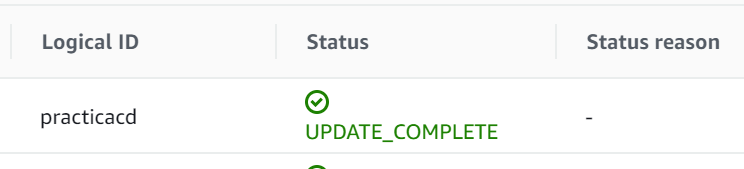

#### Máster Cloud Apps Módulo IV - DevOps, integración y despliegue continuo

# Práctica: Despliegue Continuo - Blue/Green Deployment en AWS

1. [Punto de partida](#puntodepartida)
2. [Infraestructura](#infraestructura)
    * [Creación infraestructura mediante Cloudformation](#cf)
3. [Creación del Job para el despliegue de la aplicación](#3)
4. [Modificar Jenkinsfile para añadir despliegue en las ramas release](#4)
5. [Ejemplo de funcionamiento completo](#funcionando)
    * [Despliegue de release 1.3.0](#release1)
    * [Despliegue de release 1.4.0](#release2)
6. [Pruebas continuidad servicio con Jmeter](#jmeter)
7. [Referencias documentación AWS](#docu)
---
<a name="puntodepartida"></a>
## **1. Punto de partida** 

Partimos de la aplicación de la práctica anterior (https://github.com/mscarceller/practica-ci), realizando algunos cambios:

* La base de datos MySQL ahora está desplegada mediante una RDS de AWS.
* Con cada commit en ramas de release se ejecuta el pipeline, pero ahora, además, se desplegará la imagen en la infraestructura creada en AWS para ello.


<a name="infraestructura"></a>
## **2. Infraestructura** 

El esquema final quedaría del siguiente modo:


<a name="cf"></a>
### **2.1 Creación infraestructura mediante Cloudformation**

Los elementos principales de la infraestructura que se ha añadido para publicar la web son:

* Un LoadBalancer que proporciona un endpoint público para acceder a la aplicación.
* Un ECS (Elastic Container Service) en el que se despliegan dos nodos (Services) con la aplicación (Tasks).

Toda la infraestructura se despliega mediante un fichero coludformation.yaml, mediante el cual además, se desplegarán los nuevos servicios. A continuación, se explican los elementos incluidos:

* Cluster ECS (Elastic Container Service): dentro se desplegaran nuestros servicios. Mas adelante elegiremos ejecutar los clústeres de ECS con AWS Fargate. Fargate elimina la necesidad de aprovisionar y administrar servidores:

```yaml
    Cluster:
        Type: AWS::ECS::Cluster
        Properties:
        ClusterName: mcapracticacd-cluster
```

* LogGroup: para agrupar los logs de los servicios desplegados en ECS y poder monitorizar los eventos de las aplicaciones con CloudWatch agrupados:

```yaml
    LogGroup:
        Type: AWS::Logs::LogGroup
        Properties:
        LogGroupName: mcapracticacd-log-group
```

* Rol para poder ejecutar Task dentro del cluster ECS:

```yaml
  ExecutionRole:
    Type: AWS::IAM::Role
    Properties:
      RoleName:  mcapracticacd--role
      AssumeRolePolicyDocument:
        Statement:
          - Effect: Allow
            Principal:
              Service: ecs-tasks.amazonaws.com
            Action: sts:AssumeRole
      ManagedPolicyArns:
        - arn:aws:iam::aws:policy/service-role/AmazonECSTaskExecutionRolePolicy
```

* Grupo de seguridad, para para controlar el tráfico entrante y saliente:

```yaml
  SecurityGroup:
    Type: AWS::EC2::SecurityGroup
    Properties:
      GroupDescription: !Sub ${AWS::StackName}-alb
      SecurityGroupIngress:
        - CidrIp: "0.0.0.0/0"
          IpProtocol: "TCP"
          FromPort: 8080
          ToPort: 8080
        - IpProtocol: tcp
          FromPort: 3306
          ToPort: 3306
          CidrIp: 0.0.0.0/0
      VpcId: !Ref VpcId
```

* Rol para los servicios dentro del ECS, este rol (AmazonEC2ContainerServiceRole) permitirá al load balancer registrar y desregistrar instancias de contenedores ECS: 

```yaml
  ECSServiceRole:
    Type: AWS::IAM::Role
    Properties:
      Path: /
      AssumeRolePolicyDocument:
        Statement:
        - Effect: Allow
          Principal:
            Service: [ecs.amazonaws.com]
          Action: ['sts:AssumeRole']
      ManagedPolicyArns:
        - arn:aws:iam::aws:policy/service-role/AmazonEC2ContainerServiceRole
```

* El LoadBalancer que repartirá el tráfico entre los servicios desplegados en el cluster ECS, en el que se define, además, el puerto en el que estará escuchando el balanceador:

```yaml
  LoadBalancer:
    Type: AWS::ElasticLoadBalancingV2::LoadBalancer
    Properties:
      Subnets: !Ref Subnets
      SecurityGroups:
        - !Ref SecurityGroup
  
  LoadBalancerListener:
    Type: AWS::ElasticLoadBalancingV2::Listener
    Properties:
      LoadBalancerArn: !Ref LoadBalancer
      Port: 8080
      Protocol: HTTP
      DefaultActions:
        - Type: forward
          TargetGroupArn: !Ref TargetGroup
```

* TargetGroup: se utiliza por el LoadBalancer para redireccionar solicitudes a uno o varios destinos registrados. Los principales parámetros que se especifican son:

  * Configuración de direccionamiento: se especifica el protocolo y el puerto que se debe redireccionar. En este caso seleccionamos HTTP y puerto 8080, y el tipo de destino IP (que realmente será un rango de IPs)
  * **deregistration_delay.timeout_seconds**: tiempo que Elastic Load Balancing espera antes de anular el registro de un destino.
  * Se indican los siguientes parámetros de HealthCheck para que se apliquen en e LoadBalancer:
      * **IntervalSeconds**: el intervalo en segundos entre cada solicitud enviada desde el LoadBalancer para comprobar si el servicio está disponible.
      * **HealthCheckPath**: el path al que se enviarán las solicitudes para verificar que el servicio esta disponible. En nuestro caso seleccionamos "/", ya que la web del blog responde en esa ruta con un código http 200 si todo está OK.
      * **HealthCheckProtocol**: el protocolo que el LoadBalncer usará para realizar las comprobaciones sobre el servicio. En este caso HTTP.
      * **HealthCheckTimeoutSeconds**: el número de segundos durante los cuales una respuesta negativa desde el servicio significa que no esta disponible.
      * **HealthyThresholdCount**: el número consecutivo de respuestas válidas desde un servicio para que se considere que está disponible.

  La definición quedaría:

```yaml
TargetGroup:
    Type: AWS::ElasticLoadBalancingV2::TargetGroup
    Properties:
      VpcId: !Ref VpcId
      Port: 8080
      TargetType: ip
      Protocol: HTTP
      Matcher:
        HttpCode: 200-299
      HealthCheckIntervalSeconds: 90
      HealthCheckPath: /
      HealthCheckProtocol: HTTP
      HealthCheckTimeoutSeconds: 60
      HealthyThresholdCount: 2
      TargetGroupAttributes:
        - Key: deregistration_delay.timeout_seconds
          Value: 30
    DependsOn: 
     - LoadBalancer
```

* TaskDefinition y Service, definen los contenedores que se despliegan dentro del cluster y el servicio que expone cada uno de ellos. Se especifica qué imágenes de Docker utilizar, en este caso se le pasa como parámetro, los recursos necesarios (CPU, memoria...) y otras configuraciones relacionadas con el lanzamiento de la definición de tarea a través de un servicio o tarea de Amazon ECS (grupo de logs...).
Cabe destacar el tipo de lanzamiento: Fargate,permite ejecutar aplicaciones containerizadas sin necesidad de aprovisionar más infraestructura. 

```yaml
  TaskDefinition:
    Type: AWS::ECS::TaskDefinition
    Properties:
      Family: mcapracticacd-task
      Cpu: 256
      Memory: 2048
      NetworkMode: awsvpc
      ExecutionRoleArn: !Ref ExecutionRole # Fargate requires task definition to have execution role ARN to support log driver awslogs
      ContainerDefinitions:
        - Name: mcapracticacdV1
          Image: !Ref DockerImage
          PortMappings:
            - ContainerPort: 8080
          LogConfiguration:
            LogDriver: awslogs
            Options:
              awslogs-region: !Ref AWS::Region
              awslogs-group: !Ref LogGroup
              awslogs-stream-prefix: ecs
      RequiresCompatibilities:
        - EC2
        - FARGATE

  Service:
    Type: AWS::ECS::Service
    Properties:
      ServiceName: !Ref ServiceName
      Cluster: !Ref Cluster
      TaskDefinition: !Ref TaskDefinition
      LaunchType: FARGATE
      DesiredCount: 2
      LoadBalancers:
        - ContainerName: mcapracticacdV1
          ContainerPort: 8080
          TargetGroupArn: !Ref TargetGroup
      NetworkConfiguration:
        AwsvpcConfiguration:
          AssignPublicIp: ENABLED # Private subnet with NAT gateway
          SecurityGroups:
             - !GetAtt SecurityGroup.GroupId
          Subnets: !Ref Subnets
    DependsOn: 
      - TaskDefinition
      - ECSServiceRole
```

* Las salidas que necesitamos para tener información de que todo ha ido bien. La más importante es ServiceUrl, ya que será la url dónde este disponible nuestro servicio.

```yaml
Outputs:
  ClusterName:
      Value: !Ref Cluster
  ServiceUrl:
    Description: URL of the load balancer for the application.
    Value: !Sub http://${LoadBalancer.DNSName}
  DNSName:
    Value: !GetAtt LoadBalancer.DNSName
```

**NOTA**: se podia haber añadido además una ElasticIp + Gateway, pero no era necesario para poder realizar las pruebas, al no tratarse de una aplicación real que necesite mantener siempre la misma URL.

<a name="3"></a>
## **3. Creación del Job para el despliegue de la aplicación** 

* Creamos un proyecto de tipo "estilo libre":

    

* Indicamos los parámetros que debe recibir:
    
    * El nombre de la nueva imagen que debe desplegarse.
    * El nombre del nuevo servicio que debe crearse en el cluster.
    * El fichero de cloudformation que debe usarse para el despliegue. 

    

* Definimos las variables de entorno que se necesitan para la autenticación en AWS, que previamente hemos dado de alta en las "credentials" de jenkins:

    

* Finalmente el comando a ejecutar:

    


    ```shell
    aws cloudformation deploy --template-file cloudformation.yaml --region us-east-1 --capabilities CAPABILITY_NAMED_IAM --stack-name practicacd --parameter-overrides DockerImage=$DockerImage  ServiceName=$ServiceName
    ```

<a name="4"></a>
## **4. Modificar Jenkinsfile para añadir despliegue en las ramas release** 

Modificamos el pipeline de jenkins, para incluir la llamada a este job si todo ha ido correctamente y si se trata de una rama de release:

     ```shell
        def cloudformation_file = new File("${WORKSPACE}/cloudformation.yaml")
        build(job: "DeployAWS", parameters: [
            string(name: "DockerImage", value: "$registry:${GIT_BRANCH}"), 
            string(name: "ServiceName", value: "build_${GIT_COMMIT}"),
            new FileParameterValue('cloudformation.yaml', cloudformation_file, 'original_cloudformation')
        ]) 
    ```

<a name="funcionando"></a>
## **5. Ejemplo de funcionamiento completo** 

Una vez desplegada la aplicación, inicialmente mediante el template cloudformation desde la consola de amazon web, vemos que tenemos lo siguiente:

* Cluster de ECS creado y con un servicio con dos tasks (containers):

    

* Detalles del servicio:

    

* Detalles de los containers dentro del servicio:

    

* La url publicada por el LoadBalancer:

    

* Nuestro blog publicado en dicha URL:

    

<a name="release1"></a>
### **5.1 Despliegue de release 1.3.0**

Para hacer el despliegue de la nueva aplicación bastará con hacer publicar una rama de release. En este caso vamos a publicar la versión 1.3.0 de nuestro blog, introduciendo un cambio en la web para mostrar la versión que esta publicada:

```html
    ....
    <h1>Blog </h1>(v1.3.0)
    ....
```

Se disparará de forma automática el job de jenkins sobre la nueva rama, y se sucederán los siguientes pasos:

* Job de jenkins sobre la release:

    

* Si todo va OK, y la release pasa los test se ejecuta el job de despliegue:

    

* Que lanza el comando para actualizar la aplicación:

    

* Podemos ver en la consola de AWS como llega la solicitud de Update:

    

* Se crea un service nuevo:

    

 * Se crean las tareas dentro del nuevo nodo:

    

* Una vez que las dos nuevas estan operativas se eliminan las antiguas:

    

* Y se eliminan tambien el nodo antiguo:

    

* La actualización termina correctamente:

    

* En el job de despliegue se recibe el Success:

    

* Y el job que se disparó al crear la release finaliza correctamente:

    

* La web ya dipone de la actualización introducida:

    

<a name="release2"></a>
### **5.1 Despliegue de release 1.4.0**

De igual forma que hemos hecho con la release 1.3.0 hacemos para publicar la 1.4.0:

```html
    ....
    <h1>Blog </h1>(v1.4.0)
    ....
```

Se podrían introducir más cambios, pero este es suficiente para comprobar que el proceso funciona.

<a name="jmeter"></a>
## **6. Pruebas continuidad servicio con Jmeter** 

Durante el despliegue de la versión 1.4 he hecho una pequeña prueba para comprobar si hay perdida de servicio. Para ello he usado jmeter, para hacer peticiones get a la url del blog.

* Configuración de JMeter:

    

    

* Vemos las primeras peticiones devuelven el blog con la versión 1.3.0:

    

* Vemos las últimas peticiones devuelven el blog con la versión 1.4.0:

    

* Vemos como se ha actualizado la web:

    

* No hay errores en Jmeter:

    


No vemos ninguna petición rechazada.

---

<a name="docu"></a>
## **7. Referencias documentación AWS** 

* Amazon ECS: https://docs.aws.amazon.com/AmazonECS/latest/developerguide/ecs_managed_policies.html#AmazonEC2ContainerServiceRole

* EC2 security groups:
https://docs.aws.amazon.com/AWSEC2/latest/UserGuide/ec2-security-groups.html

* ECS Task Execution IAM Role:
https://docs.aws.amazon.com/AmazonECS/latest/developerguide/task_execution_IAM_role.html

* Log Groups:
https://docs.aws.amazon.com/AmazonCloudWatch/latest/logs/Working-with-log-groups-and-streams.html

* Target Groups:
https://docs.aws.amazon.com/elasticloadbalancing/latest/application/load-balancer-target-groups.html

* Routing Configuration:
https://docs.aws.amazon.com/elasticloadbalancing/latest/application/load-balancer-target-groups.html#target-group-routing-configuration

* Health Checks Target Groups:
https://docs.aws.amazon.com/elasticloadbalancing/latest/application/target-group-health-checks.html

* AWS::ECS::TaskDefinition:
https://docs.aws.amazon.com/AWSCloudFormation/latest/UserGuide/aws-resource-ecs-taskdefinition.html#cfn-ecs-taskdefinition-requirescompatibilities

* AWS::ECS::Service:
https://docs.aws.amazon.com/es_es/AWSCloudFormation/latest/UserGuide/aws-resource-ecs-service.html

* Amazon ECS Launch Types
https://docs.aws.amazon.com/AmazonECS/latest/developerguide/launch_types.html

* Amazon ECS on AWS Fargate:
https://docs.aws.amazon.com/AmazonECS/latest/developerguide/AWS_Fargate.html
